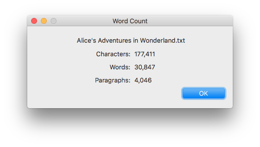

Word Count
==========

Counts the number of characters, words, and paragraphs in the topmost TextEdit
document.

## Install
Download the app from the [releases][1] page. Unzip it and drag it to the
`Applications` folder.

Word Count is designed to work on Mac OS X 10.6 and later.

## License
Copyright © 2018 Teddy Wing. Licensed under the GNU GPLv3+ (see the included
COPYING file).

[1]: https://github.com/teddywing/Word-Count/releases
